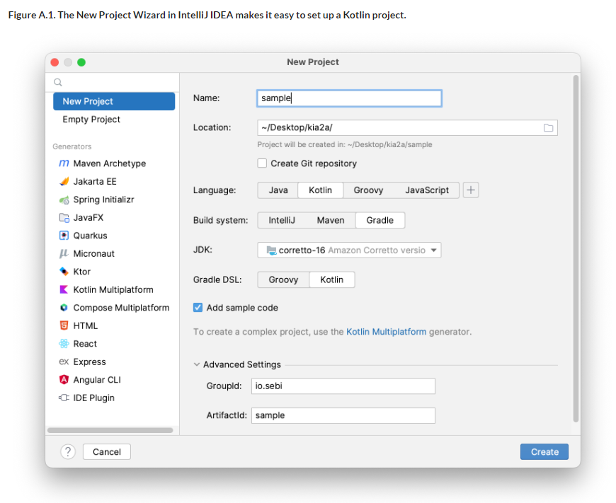

# Appendix A. Building Kotlin projects

This appendix explains how to build Kotlin code with Gradle and Maven, the two most popular build systems used with Kotlin projects.

## A.1 Building Kotlin code with Gradle

The recommended system for building Kotlin projects is Gradle. Gradle has become the de-facto standard build system for Kotlin projects, both on Android and beyond. It has a flexible project model and delivers great build performance thanks to its support for incremental builds, long-lived build processes (the Gradle daemon), and other advanced techniques.

Gradle allows you to write your build scripts either in Kotlin or Groovy. In this book, we use Gradle’s Kotlin syntax, meaning both your build configuration and your actual application are written in the same language.

The easiest way to create a Gradle project with Kotlin support is via the builtin project wizard in IntelliJ IDEA, which you can find under "File | New… | Project", or via the "New Project" button on the Welcome Screen.

Figure A.1. The New Project Wizard in IntelliJ IDEA makes it easy to set up a Kotlin project.



The standard Gradle build script for building a Kotlin project looks like this:

```kotlin
import org.jetbrains.kotlin.gradle.tasks.KotlinCompile

plugins {
    kotlin("jvm") version "1.7.10"
}

group = "org.example"
version = "1.0-SNAPSHOT"

repositories {
    mavenCentral()
}

dependencies {
    testImplementation(kotlin("test"))
}

tasks.test {
    useJUnitPlatform()
}

tasks.withType<KotlinCompile> {
    kotlinOptions.jvmTarget = "1.8"
}
```

The script looks for Kotlin source files in the following locations:

1. `src/main/kotlin` and `src/main/java` for the production source files
2. `src/test/java` and `src/test/kotlin` for the test source files

Especially when you’re introducing Kotlin into an existing project, using a single source directory reduces friction when converting Java files to Kotlin.

If you’re using Kotlin reflection, which you’ve gotten to know in Chapter 12, you need to add one more dependency: the Kotlin reflection library. To do so, add the following in the dependencies section of your Gradle build script:

```kotlin
implementation(kotlin("reflect"))
```

### A.1.1 Building projects that use annotation processing

Many Java frameworks, especially those used in Android development, rely on annotation processing to generate code at compile time. To use those frameworks with Kotlin, you need to enable Kotlin annotation processing in your build script. You can do this by adding the following line to the plugins block of your build file:

```kotlin
kotlin("kapt") version "1.7.10"
```

If you have an existing Java project that uses annotation processing and you’re introducing Kotlin to it, you need to remove the existing configuration of the `apt` tool. The Kotlin annotation processing tool handles both Java and Kotlin classes, and having two separate annotation processing tools would be redundant. To configure dependencies required for annotation processing, use the `kapt` dependency configuration:

```kotlin
dependencies {
    implementation("com.google.dagger:dagger:2.44.2")
    kapt("com.google.dagger:dagger-compiler:2.44.2")
}
```

If you use annotation processors for your `androidTest` or `test` source, the respective `kapt` configurations are named `kaptAndroidTest` and `kaptTest`.

## A.2 Building Kotlin projects with Maven

If you prefer to build your projects with Maven, Kotlin supports that as well. The easiest way to create a Kotlin Maven project is to use the `org.jetbrains.kotlin:kotlin-archetype-jvm` archetype. For existing Maven projects, you can easily add Kotlin support by choosing Tools > Kotlin > Configure Kotlin in Project in the Kotlin IntelliJ IDEA plugin.

To add Maven support to a Kotlin project manually, you need to perform the following steps:

1. Add dependency on the Kotlin standard library (group ID `org.jetbrains.kotlin`, artifact ID `kotlin-stdlib`).
2. Add the Kotlin Maven plugin (group ID `org.jetbrains.kotlin`, artifact ID `kotlin-maven-plugin`), and configure its execution in the `compile` and `test-compile` phases.
3. Configure source directories, if you prefer to keep your Kotlin code in a source root separate from Java source code.

For reasons of space, we’re not showing full `pom.xml` examples here, but you can find them in the online documentation at https://kotlinlang.org/docs/maven.html.

In a mixed Java/Kotlin project, you need to configure the Kotlin plugin so that it runs before the Java plugin. This is necessary because the Kotlin plugin can parse Java sources, whereas the Java plugin can only read `.class` files; so, the Kotlin files need to be compiled to `.class` before the Java plugin runs. You can find an example showing how this can be configured at https://kotlinlang.org/docs/maven.html#compile-kotlin-and-java-sources.
